# 📚 AI Book Summary App

An Android application that allows users to search, explore, and save books while generating **AI-powered summaries** using **Gemini AI API**.
Built with **Google Books API**, **Firebase Authentication & Realtime Database**, **Gemini AI API**, and **Material Design**.

---

# 📃 Table of Contents

1. [ Features](#✨-features)
2. [ Tech Stack](#🛠️-tech-stack)
3. [ Project Structure](#📂-project-structure)
4. [ How it Works](#🚀-how-it-works)
5. [ Implemented APIs](#✅-implemented-apis)
6. [Extra Features](#🏱️-extra-features)
7. [ Possible Future Improvements](#🚧-possible-future-improvements)
8. [ Screenshots](#📸-screenshots)
9. [ Contributing](#🤝-contributing)
10. [License](#📄-license)

---

# ✨ Features

### 🔐 Authentication

* **Google Sign-In** using Firebase Authentication
* User profile (display name & email)
* Secure logout functionality

### 🏠 Home Activity

* Displays **recommended books** on home screen
* **Google Books API** used to fetch real-time book data
* Responsive UI with **RecyclerView** and **CardView**
* **Bottom Navigation** for quick access to Home, Saved Books, and Profile

### 🔍 Search Functionality

* **Search books** by:

    * Title
    * Author
    * Publisher
    * Book description

### 📚 Saved Books

* Save favorite books to **Firebase Realtime Database**
* **Per-user storage** using their Google account
* View and remove saved books

### 📖 Book Detail Page

* Displays:

    * Book cover image
    * Authors, publisher, publish year
    * Categories
    * Description
* **AI-generated book summary** (using **Gemini AI API**)
* **Preview** and **More Info** links powered by Google Books API

### 🎧 Drawer Menu

* Browse books by **category** (fiction, non-fiction, history, education, art, technology, etc.)
* Dynamic category-based book loading

### 🌟 AI Summary

* **Gemini AI API** used to generate dynamic book summaries
* Option to copy or share the summary

### 🧑‍💼 Profile Activity

* Displays user profile info
* Option to **logout**

---

# 🛠️ Tech Stack

| Component            | Technology                               |
| -------------------- | ---------------------------------------- |
| Language             | Java                                     |
| Architecture         | MVVM                                     |
| Backend APIs         | Google Books API, Gemini AI API          |
| Authentication       | Firebase Authentication (Google Sign-In) |
| Database             | Firebase Realtime Database               |
| UI Framework         | Material Design                          |
| Image Loading        | Glide                                    |
| Networking           | Retrofit                                 |
| Dependency Injection | ViewModelProvider                        |
| Other                | Google Credentials API                   |

---

## 📂 Project Structure

```plaintext
com.example.aibooksummaryapp
🔗 Activity
🔗    MainActivity
🔗    LoginActivity
🔗    ProfileActivity
🔗    SavedBooksActivity
🔗    BookDetailActivity
🔗    BaseNavActivity
🔗 Adapter
🔗    BookAdapter
🔗 API_Interface
🔗    GeminiApi
🔗    GeminiClient
🔗    GoogleBookApiClient
🔗    GoogleBooksApi
🔗 APIModels
🔗    GeminiRequest
🔗    GeminiResponse
🔗 Model
🔗    Book
🔗    BookResponse
🔗    ChatRequest
🔗    ChatResponse
🔗    ImageLinks
🔗    VolumeInfo
🔗 Repository
🔗    BookRepository
🔗    GeminiRepository
🔗 ViewModel
🔗    BookViewModel
```

---

#  How it Works

1️⃣ **User Login**  -> Google Sign-In through Firebase

2️⃣ **Search & Browse Books**  -> Google Books API provides book data

3️⃣ **AI Summary Generation**  -> Gemini API used to create concise summaries of books

4️⃣ **Save & Manage Favorite Books**  -> Saved securely in Firebase Realtime Database

5️⃣ **Navigation**  -> Smooth UX with:

* Top App Bar
* Bottom Navigation Bar
* Drawer Menu
* Search Bar

---


# ✅ Implemented APIs

* Google Books API
* Gemini AI API
* Firebase Authentication
* Firebase Realtime Database

---

# 🏱️ Extra Features

* Outstanding Navigation

    * **Top AppBar**
    * **Bottom Navigation**
    * **Drawer Menu**
    * **RecyclerView** & **CardView**
* Dynamic **AI Summary generation**
* **User-specific Saved Books** with Firebase Realtime Database
* **Smooth UI/UX** with Material Design Components

---

# Possible Future Improvements

* Add **Offline Mode** for saved books
* Add **RLS** (Role Level Security) for book access
* Implement **Forecasting** or **Recommendations** using ML models
* Add **Pagination** for large book lists
* Dark/Light Theme toggle

---

# 📸 Screenshots


## **Login Screen**

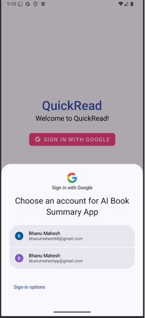
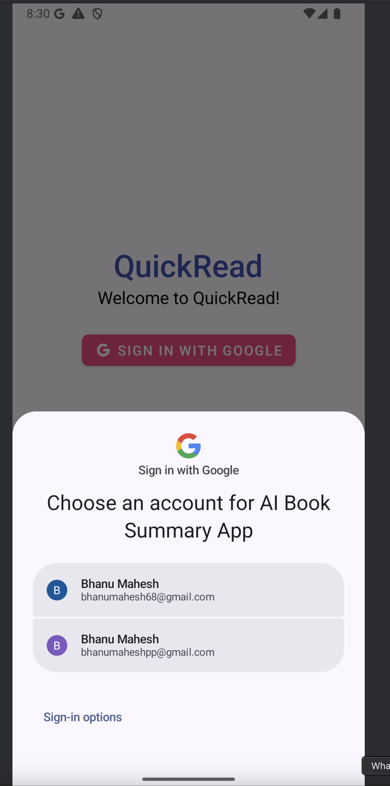

* Users can log in using **Google Sign-In** (Firebase Authentication).
* Secure login with Google account.
* After successful login, users are navigated to Home.

---

## **Home Activity**

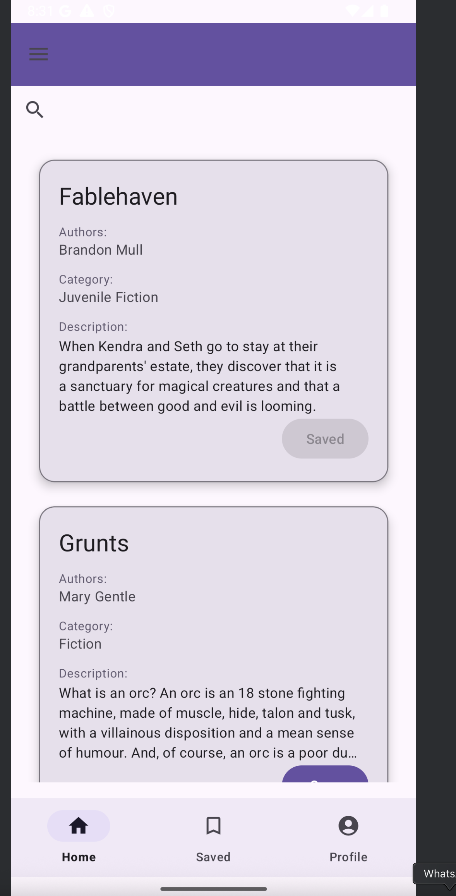

* Displays **recommended books** using **Google Books API**.
* List of books shown with cover image, title, author.
* Option to **Save books** to favorites.

---

## **Options to Save Books**

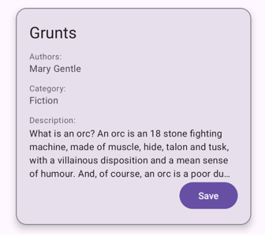

* **Save** button available on each book card.
* Saved books are stored in **Firebase Realtime Database**.

---

## **Saved Books Activity**

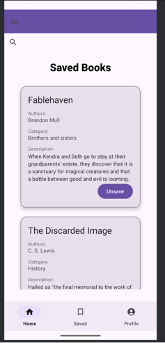

* Displays the list of **Saved Books**.
* Option to **Unsave** books.
* Data is **user-specific** using Google Sign-In.

---

## **Clicking on Card** (Book Detail Page)

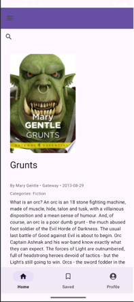

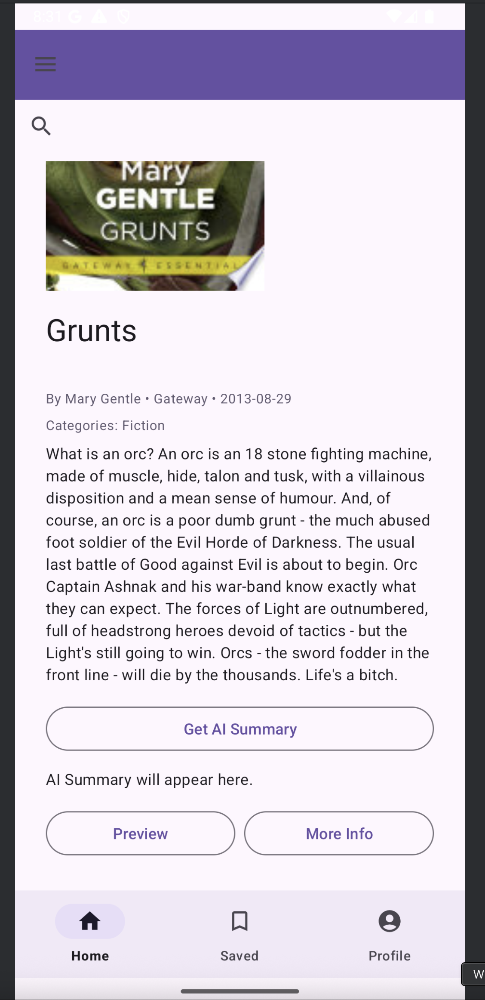

* On clicking a book, detailed view opens:

    * Book cover image
    * Title, subtitle
    * Authors, publisher, published year
    * Categories
    * Description
    * Options to:

        * Get **AI-generated summary**
        * **Preview** the book
        * View **More Info** link

---

## **AI Summary**

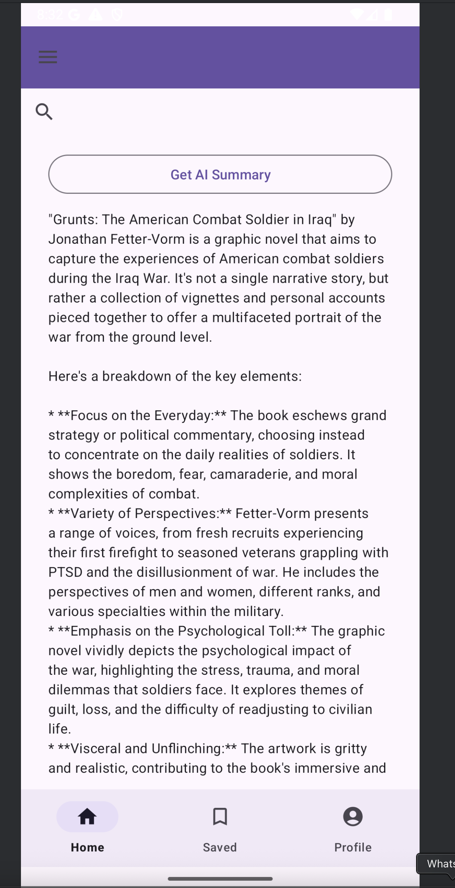

* Clicking **Get AI Summary** generates a book summary using **Gemini AI API**.
* Dynamic, on-demand **AI-generated book summary**.

---

## **Preview Option**

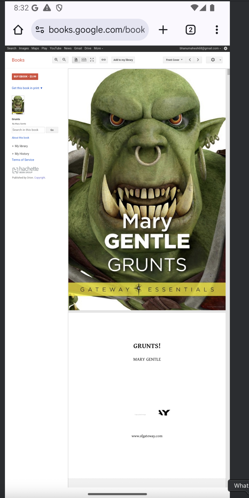

* Opens **Preview link** (provided by Google Books API).
* Allows user to preview the book in Google Books.

---

## **More Info**

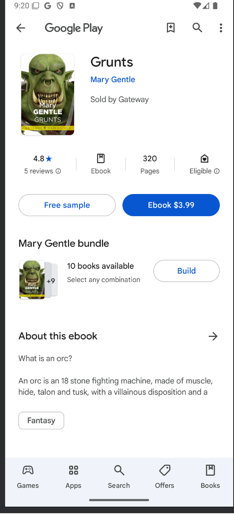

* Opens **More Info link** from Google Books API.
* Provides additional book metadata and related links.

---

## **Drawer Menu**

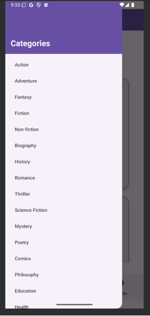

* **Category navigation** for books.
* User can select from multiple categories (fiction, non-fiction, biography, history, science, etc.).
* Dynamically loads books relevant to the selected category.

---

## **Search Option**

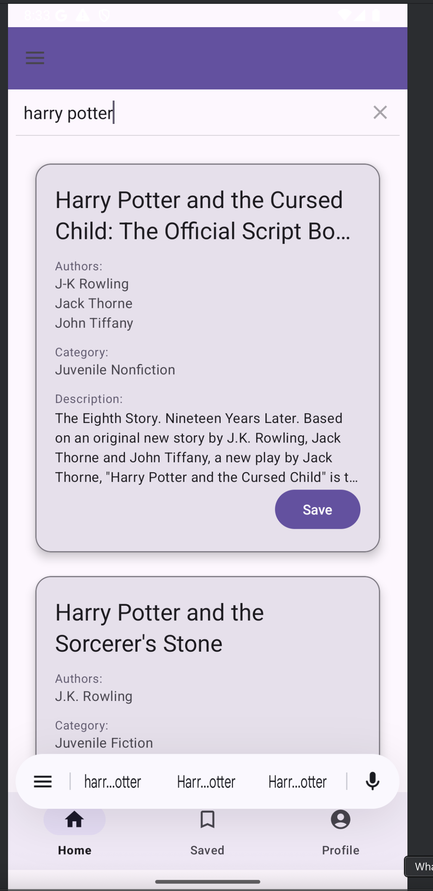

* **Search bar** to search books by:

    * Title
    * Author
    * Publisher
    * Description
* Real-time search on Google Books API.

---

## **Profile Activity**

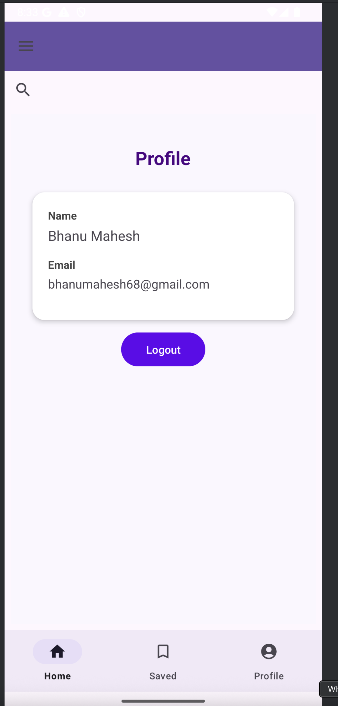

* Displays **user details** (name & email).
* **Logout button** to sign out of the app.


---
