## **Home Activity**

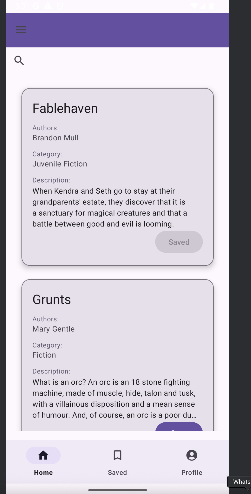

* Displays **recommended books** using **Google Books API**.
* List of books shown with cover image, title, author.
* Option to **Save books** to favorites.

---

## **Options to Save Books**

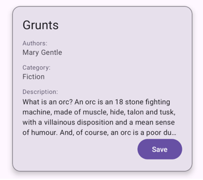

* **Save** button available on each book card.
* Saved books are stored in **Firebase Realtime Database**.

---
## **Drawer Menu**

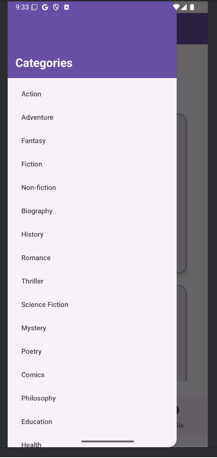

* **Category navigation** for books.
* User can select from multiple categories (fiction, non-fiction, biography, history, science, etc.).
* Dynamically loads books relevant to the selected category.

---

## **Search Option**

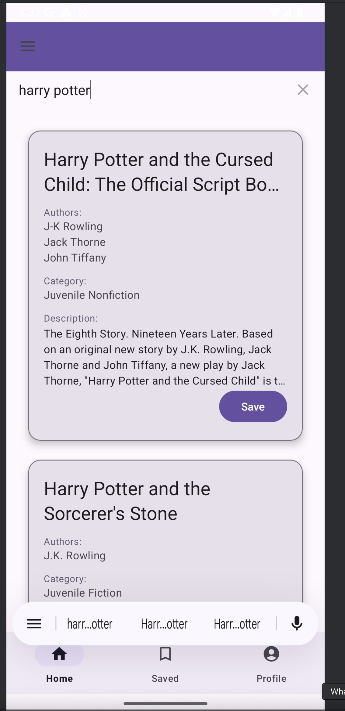

* **Search bar** to search books by:

    * Title
    * Author
    * Publisher
    * Description
* Real-time search on Google Books API.

---
## **Saved Books Activity**

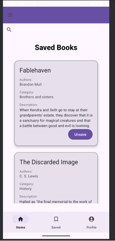

* Displays the list of **Saved Books**.
* Option to **Unsave** books.
* Data is **user-specific** using Google Sign-In.

---

## **Clicking on Card** (Book Detail Page)

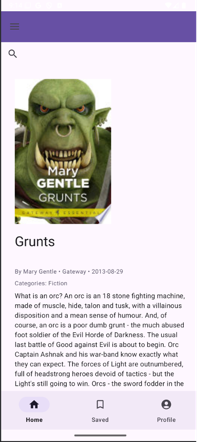

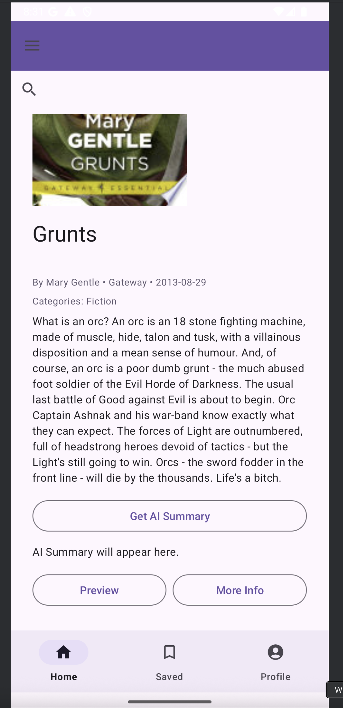

* On clicking a book, detailed view opens:

    * Book cover image
    * Title, subtitle
    * Authors, publisher, published year
    * Categories
    * Description
    * Options to:

        * Get **AI-generated summary**
        * **Preview** the book
        * View **More Info** link

---

## **AI Summary**

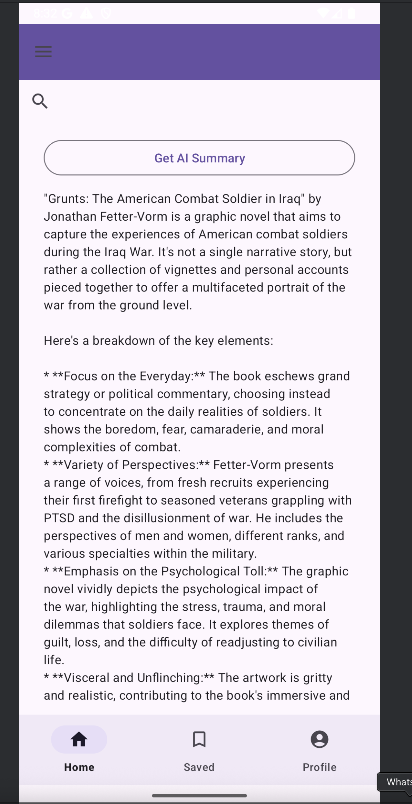

* Clicking **Get AI Summary** generates a book summary using **Gemini AI API**.
* Dynamic, on-demand **AI-generated book summary**.

---

## **Preview Option**

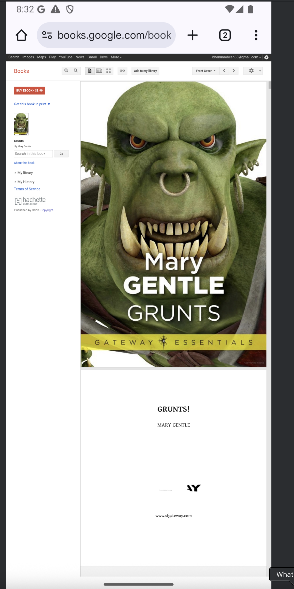

* Opens **Preview link** (provided by Google Books API).
* Allows user to preview the book in Google Books.

---

## **More Info**

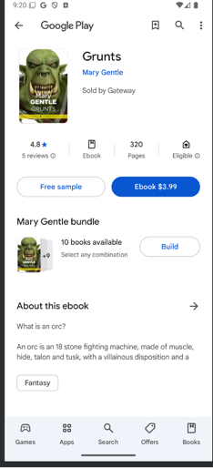

* Opens **More Info link** from Google Books API.
* Provides additional book metadata and related links.

---

## **Profile Activity**

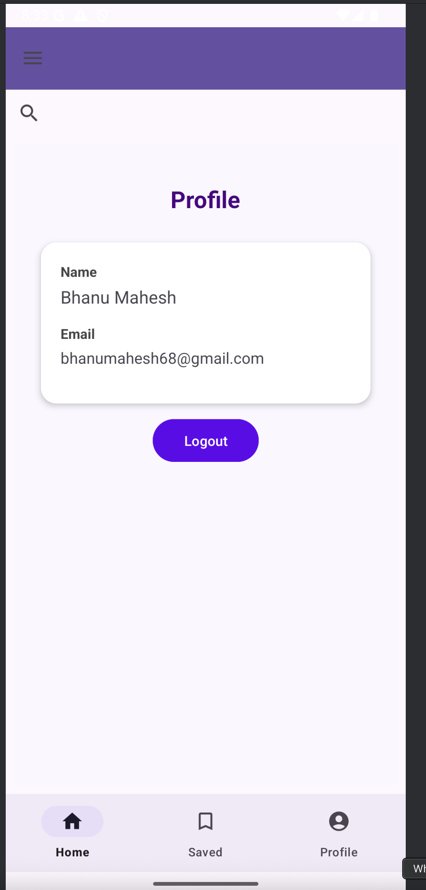

* Displays **user details** (name & email).
* **Logout button** to sign out of the app.

---

