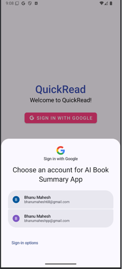
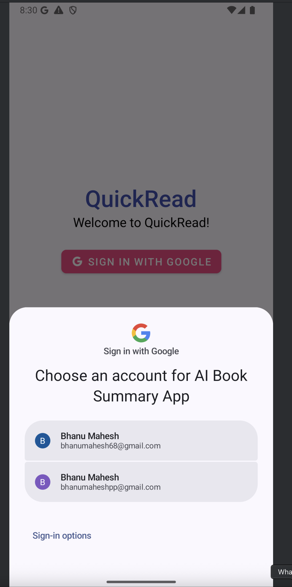

# Quick Read- AI Book Summary Android App – UI Overview  

This application is designed to search, explore, and save books while generating **AI-powered summaries** using **Gemini AI API**.

Built with **Java**, **Andriod Studios**, **Google Books API**, **Firebase Authentication & Realtime Database**, **Gemini AI API**, and **Material Design**.

Below is a walkthrough of the key UI pages and their functionalities.  

---
## **Login Screen**

* Users can log in using **Google Sign-In** (Firebase Authentication).
* Secure login with Google account.
* After successful login, users are navigated to Home.

---
## **Home Activity**

* Displays **recommended books** using **Google Books API**.
* List of books shown with cover image, title, author.
* Option to **Save books** to favorites.

---
## **Drawer Menu**

* **Category navigation** for books.
* User can select from multiple categories (fiction, non-fiction, biography, history, science, etc.).
* Dynamically loads books relevant to the selected category.

---
## **Options to Save Books**

* **Save** button available on each book card.
* Saved books are stored in **Firebase Realtime Database**.

---

## **Search Option**

* **Search bar** to search books by:

    * Title
    * Author
    * Publisher
    * Description
* Real-time search on Google Books API.

---
## **Saved Books Activity**

* Displays the list of **Saved Books**.
* Option to **Unsave** books.
* Data is **user-specific** using Google Sign-In.

---

## **Clicking on Card** (Book Detail Page)

* On clicking a book, detailed view opens:

    * Book cover image
    * Title, subtitle
    * Authors, publisher, published year
    * Categories
    * Description
    * Options to:

        * Get **AI-generated summary**
        * **Preview** the book
        * View **More Info** link

---

## **AI Summary**

* Clicking **Get AI Summary** generates a book summary using **Gemini AI API**.
* Dynamic, on-demand **AI-generated book summary**.

---

## **Preview Option**

* Opens **Preview link** (provided by Google Books API).
* Allows user to preview the book in Google Books.

---

## **More Info**

* Opens **More Info link** from Google Books API.
* Provides additional book metadata and related links.

---

## **Profile Activity**

* Displays **user details** (name & email).
* **Logout button** to sign out of the app.

---

